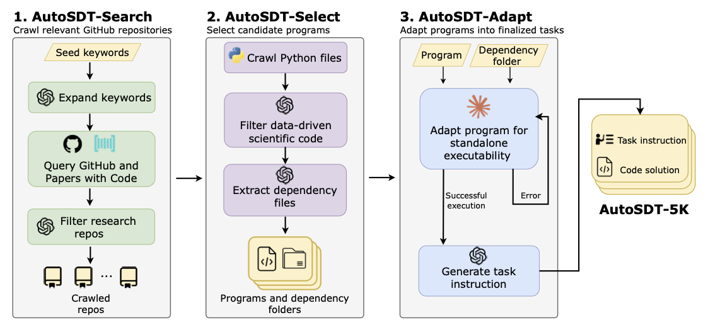
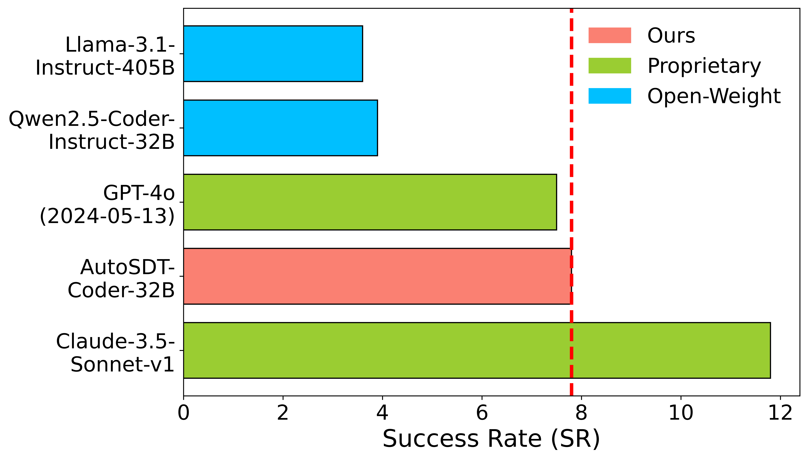

# AutoSDT
This is the official codebase of AutoSDT:
Scaling Data-Driven Discovery Tasks Toward Open Co-Scientists.

<p align="center">
[<a href="https://osu-nlp-group.github.io/AutoSDT/">Website</a>] •
[<a href="">Paper</a>] •
[<a href="https://huggingface.co/datasets/osunlp/AutoSDT-5K">Benchmark</a>] •
[<a href="">Twitter</a>]
</p>

<br>
<div align="center">
  
</div>

## Highlights

Fine-tuned on AutoSDT-5K, AutoSDT-Coder-32B achieves the same level of performance as GPT-4o (2024-05-13):
<div align="left">
  
</div>

## Table-of-Contents
- [📌 Introduction](#introduction)
- [⚙️ Installation](#installation)
- [🚀 AutoSDT-Pipeline](#AutoSDT-Pipeline)
- [🛠️ Training and Inference](#training-and-inference)
- [📧 Contact](#contact)
- [📜 License](#license)
- [📄 Disclaimer](#disclaimer)
- [📖 Citation](#citation)

## Introduction
Despite long-standing efforts in accelerating scientific discovery with AI, building reliable AI co-scientists remains challenging due to the lack of high-quality data for training and evaluation. To address this data scarcity problem, we introduce AutoSDT—an automatic pipeline that collects high-quality coding tasks from real-world data-driven discovery workflows.

AutoSDT leverages the coding capabilities and parametric knowledge of large language models (LLMs) to search from diverse sources, identify ecologically valid scientific tasks, and synthesize both task instructions and code solutions automatically. Using this pipeline, we construct AutoSDT-5K, a dataset of 5,404 scientific coding tasks spanning four scientific disciplines and using 756 unique Python packages.
- AutoSDT-5K is the largest and the only automatically collected open dataset for data-driven scientific discovery.
- Models trained on AutoSDT-5K, named AutoSDT-Coder, AutoSDT-Coder-32B reaches GPT-4o-level performance on ScienceAgentBench with a success rate of 7.8%, doubling the performance of its base model.
- It also improves hypothesis matching score by 17.4% on DiscoveryBench, significantly narrowing the gap between open-weight models and proprietary ones.

## Installation
Clone this repository and install the required packages:
```python
git clone https://github.com/OSU-NLP-Group/AutoSDT
cd AutoSDT
pip install -r requirements.txt
```

## **AutoSDT Pipeline**
### Configure Azure endpoint and API key
```python
vim ~/.bashrc
export AZURE_OPENAI_KEY=YOUR_AZURE_API_KEY
export AZURE_ENDPOINT=YOUR_AZURE_ENDPOINT
export AZURE_API_VERSION=YOUR_AZURE_API_VERSION
source ~/.bashrc
```

### AutoSDT-Crawl: Download repos to local dir and extract py files
```python
cd CodingAgent/scripts
bash run_crawl_scientific_py_files.sh
```

### AutoSDT-Select-Step1: Model-based scientific task verification
```python
bash run_scientific_task_verify.sh
```

### AutoSDT-Select-Step2: Model-based dataset locating
```python
bash run_locate_dataset.sh
```

### AutoSDT-Select-Step3: Move the datasets to the right place
```python
bash run_prepare_dataset_env.sh
```

### AutoSDT-Adapt
```python
cd ../..
bash CodingAgent/scripts/clone_envs.sh
bash run_coding_agent.sh
cd CodingAgent/scripts
bash run_gen_inst.sh
```

After the above steps, you should obtain a `final_combined_training_data.jsonl` containing the generated instructions and code. After that, run
```python
python convert_data_to_alpaca_format.py
```
to convert the data format into alpaca training format.

## Training and Inference
### Supervised Fine-tuning
We use the [LLaMA-Factory](https://github.com/hiyouga/LLaMA-Factory) library to conduct SFT experiments. We provide the `.yaml` files within this repo:

```python
-- qwen2.5-coder-7b-instruct_full_sft.yaml
-- qwen2.5-coder-7b-instruct_full_sft.yaml
-- qwen2.5-coder-7b-instruct_full_sft.yaml
```
Please refer to [LLaMA-Factory](https://github.com/hiyouga/LLaMA-Factory) for more details.

### Inference and Evaluation
For ScienceAgentBench, we directly follow the original repo for running inference and evaluation. Please refer to `ScienceAgentBench/README.md` for more information.

For DiscoveryBench, first start an LLM engine at localhost using [vllm](https://docs.vllm.ai/en/latest/), then run
```python
python evaluate_with_llm_engine.py
```
to generate all the evaluation results, and run
```python
python cal_eval_avg.py
```
to compute the final results.

## Contact
[Yifei Li](mailto:li.14042@osu.edu), [Hanane Nour Moussa](mailto:moussa.45@osu.edu), [Huan Sun](mailto:sun.397@osu.edu), The Ohio State University

## License

We ensure that all 1325 repositories composing the final tasks in AutoSDT-5K allow for non-proprietary use. We list the licenses and the number of corresponding repositories in the following table:

| License        | # of Repositories |
|----------------|-------------------|
| MIT            | 507               |
| GNU            | 247               |
| Apache         | 145               |
| BSD            | 84                |
| Boost          | 4                 |
| Public Domain  | 3                 |
| ISC            | 1                 |
| Eclipse        | 1                 |
| Other (Custom) | 16                |

We manually checked the remaining 16 repositories with custom licenses and ensured that they all allow academic and non-commercial use:

| Repository                              |
|------------------------------------------|
| GabrieleLozupone/AXIAL                  |
| fhalab/MLDE                              |
| snacktavish/TreeToReads                  |
| ninglab/G2Retro                          |
| usnistgov/SDNist                         |
| CSi-Studio/3D-MSNet                      |
| SNU-LIST/QSMnet                          |
| pygbe/pygbe                              |
| Ramprasad-Group/polygnn                  |
| gdalessi/OpenMORe                        |
| svalkiers/clusTCR                        |
| AI-sandbox/SALAI-Net                     |
| pixelite1201/agora_evaluation           |
| jsunn-y/PolymerGasMembraneML            |
| spectrochempy/spectrochempy              |
| usnistgov/atomgpt                        |

There are also 317 repositories without any license information. We assume that these repositories are permissive for academic purposes.

Code under this repo is licensed under a MIT License.

## Disclaimer
AutoSDT is constructed from publicly available scientific data, publications, and open-source code repositories. We have made every effort to cite original sources and respect the intellectual property of their creators. Details including references and licenses are provided in Appendix I of the AutoSDT paper. If any repository owner wishes to request removal or correction of relevant content, we welcome communication to ensure proper attribution and compliance.

## Citation
Please cite our paper if you use our data, model, or code.
